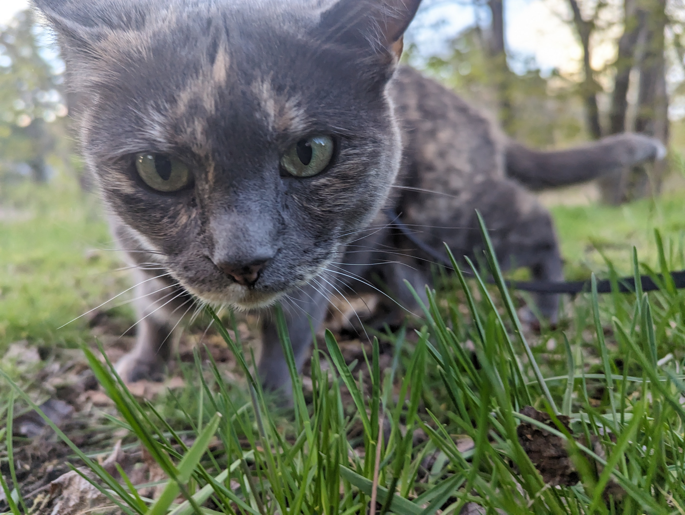

## Introduction



## Different scale(s) are most meaningful for a given decision or research question

We design studies at different scales, because

(1) decision-makers require data at different spatio-temporal scales and

(2) scientists seek to understand how ecosystem processes and properties vary across scales.

There are cost and time constraints to collecting data; therefore, we target the scale most relevant for a given question or decision.

    

*Created by Ágnes Vári. The idea behind this drawing is to start as a decision-maker, researcher, and/or explorer, and show how the view (scale) may change, in a fun way, before we dive into the scientific details. We will finish this sketch after the AGM. *

### Defining terms

`[Placeholder text: We plan to hire an illustrator to create a visual defining the terms: ecosystem service, supply, demand, flow, benefit, etc. There will be one hexagon at a landscape scale and a second hexagon nested behind at a regional scale. We will also add a glossary section for readers to find more information on the terms used in this story map.]`

### Changing spatial and temporal scales

Often data is only available (or can only be collected) at one scale; however, we need information at a different scale to inform a decision or to understand an ecological process. In the figure below we visualize what it means to increase (a) spatial grain size, (b) spatial extent, (c) temporal resolution, and (d) time period.

### Why do we scale up or down?

We may scale up or down for many reasons, including these examples:

1.   It can be expensive, time-consuming, and dangerous to collect data points in the field at every possible location. Instead, we stratify (e.g., partition) a larger landscape into smaller homogenous areas and take representative samples within each group.

2.   Ecological processes can be difficult to observe directly, including when processes are too fast, too slow, too small, or too large. We develop models to visualize a reality that is inaccessible to our senses.

3.   Management and policy decisions may require data at a different scale (e.g., extent or grain) compared to the scale of available data. For example, we may collect field data about a management intervention at a local scale; however, we may rely on models to test how scaling these interventions could affect outcomes at a larger scale.

4.  There are many decision-makers at different (nested) spatial scales, with their own mandates, agendas, and actions. Land-use planning policies are often developed considering scales that represent political needs at regional scales, which may or may not be consistent with ecological and societal needs at local scales. For example, climate change mitigation actions at a national scale, may not address heterogeneous needs at finer scales, for example cooling effects at the neighborhood scale.
